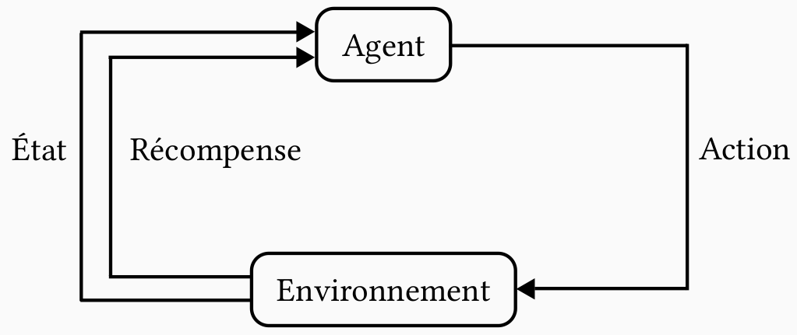

# Tetris

Joueur artificiel pour Tetris

# Compilation / Exécution

**Pour l'algorithme d'itération de la valeur :**  
- Compilation : `gcc -o iteration_valeur iteration_valeur.c`  
- Exécution : `./iteration_valeur`  
À l'exécution, le modèle va d'abord être entraîné puis stocker dans deux fichiers et enfin testé sur 10000 partie de tetris (la moyenne du score sera affichée).

**Pour l'algorithme d'entropie croisée :**
- Compilation : `gcc -o entropi_croisee entropi_croisee.c tetris_heuristique.c -lm`
- Exécution : `./entropi_croisee`  
À l'exécution, le programme tourne dans une boucle infinie et s'améliore à chaque itération. Contrôle C pour l'arrêté.  
Les valeurs pour mu et sigma sont affichées à chaque itération.

**Pour tester avec les heuristiques :**
- Compilation : `gcc -o test test.c tetris_heuristique.c`
- Exécution : `/test`  
L'exécution peut prendre un certain temps.

# Itération de la valeur
Processus de décision markovien (MDP) :



L'agent peut effectuer une action sur l'environnement et en retour, il reçoit un nouvel état et une récompense.

L'équation de Bellman donne pour les MDP :
$$ V^\pi(s) = \underbrace{R(s, \pi(s))}_{\text{Récompense immédiate}} + \underbrace{\sum_{s' \in S} T(s,\pi(s),s') \cdot V^\pi(s)}_{\text{Espérance des récompenses futures}} $$

Avec $\pi$ la fonction qui à un état renvoie l'action à effectuer  
$R$ la fonction de récompense, pour un état et une action elle renvoie la récompense.  
$T$ la fonction de transition, elle renvoie la probabilité de passer d'un état à un autre en jouant une certaine action.  
$V^\pi$ est l'espérance des récompenses futures en suivant la politique $\pi$  

On peut définir la fonction de valeur optimale : $$ V^*(s) = \max_\pi V^\pi(s) $$

On obtient donc l'équation d'optimalité de Bellman :
$$ V^*(s) = \max_{a \in A} \left( R(s, a) + \sum_{s' \in S} T(s,a,s') \cdot V^*(s) \right) $$

Si on introduit l'opérateur $B^*$ on a : $$ [B^*V](s) = \max_{a \in A} \left( R(s, a) + \sum_{s' \in S} T(s,a,s') \cdot V(s) \right) $$

L'unique point fixe de $B^*$ est $V^*$

L'un des algorithmes pour trouver $V^*$ est l'itération de la valeur :  
```
iteration de la valeur :
t <- 0
V_0 arbitraire
Répéter :
    V_(t+1) <- B* V_t
    t <- t+1
Jusqu'à convergence de V_t
```

Cet algorithme nécessite de stocker un tableau $V$ de taille le nombre d'états.  
Cette méthode ne fonctionne donc que pour des petites tailles de Tetris, car le nombre d'états est de l'ordre de $2^{\text{le nombre de cases de la grille}}$.

Le fichier `iteration_valeur.c` contient l'algorithme d'itération de la valeur appliqué à un Tetris de taille 4x5.

# Heuristique

Une méthode pour des Tetris de plus grande taille est d'utiliser une heuristique pour la fonction de valeur.  
Une heuristique est une fonction qui prend en entrée l'état du jeu et renvoie une valeur. Cette valeur doit être grande pour les bons états et petite pour les états qui ne permettent pas d'avoir un grand score.

Pour ce faire, on utilise une liste de critères sur la grille de Tetris et on multiplie chaque critère par un poids.

Cette méthode est utilisée par le fichier `tetris_heuristique.c`  
Il y a 3 heuristiques implémentées celle de Dellacherie, celle de Bertsekas et Ioffe et une heuristique issue de Dellacherie.

# Entropie croisée

L'objectif de l'entropie croisée est de déterminer les meilleurs poids pour une heuristique donnée.  
Pour faire cela, on itère sur des distributions de solutions.

### Illustration en dimension 2 :


1. Commencer avec une distribution gaussienne $\mathcal{N} (\mu, \sigma^2)$.
2. Générer $N$ vecteurs avec cette distribution.
3. Evaluer chaque vecteur et sélectionner une proportion $\rho$ des meilleurs vecteurs. Ces vecteurs sont représentés en gris.
4. Calculer la moyenne et la variance des meilleurs vecteurs.
5. Ajouter un terme de bruit à la variance, afin d’éviter une convergence trop rapide vers un optimum local.
6. Cette moyenne et cette variance caractérisent une nouvelle distribution gaussienne qui générera des vecteurs pour la prochaine itération.

Ce qui donne l'algorithme suivant :

```
Entropie croisée :
Pour tout i dans [1,m], mu_i <- 0
Pour tout i dans [1,m], sigma_i <- 100
rho <- 0.1
N <- 100
Répéter :
    Générer N vecteur de poids oméga = (oméga_1, ..., oméga_m)
        avec oméga_i suit une loi normale de paramètre mu_i, sigma_i
    Évaluer chaque vecteur (en jouant une partie de Tetris)
    Sélectionner les rho * N meilleurs vecteur
    Pour i dans [1,m] :
        mu_i <- moyenne du poids i
        sigma_i ^ 2 <- (variance du poids i) + un bruit
Jusqu'à max sigma_i < epsilon
```

Cet algorithme est dans le fichier `entropie_croisee.c`